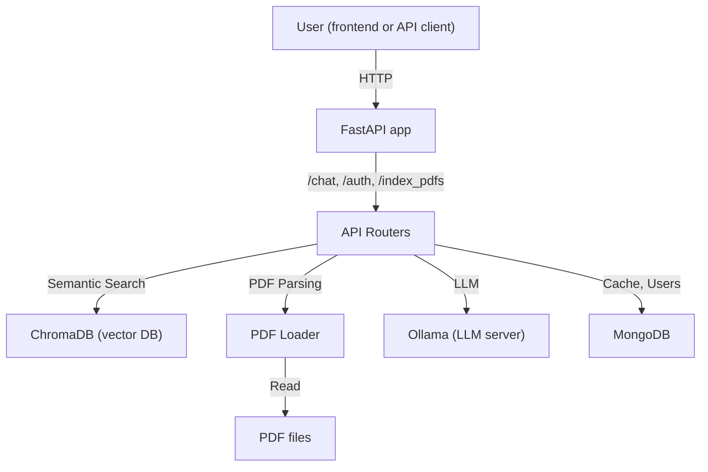

# LocalChatGPT

A local, private chatbot powered by LLMs (via Ollama) with knowledge sourced from your own PDF documents. All data and models run on your machine—no cloud required.

---

## Features
- **Chat with your PDFs:** Ask questions and get answers based on the content of your uploaded PDF files.
- **Local LLM:** Uses [Ollama](https://ollama.com/) to run LLMs (default: Llama2) on your hardware.
- **Semantic Search:** Finds relevant PDF content using embeddings (Sentence Transformers + ChromaDB).
- **User Authentication:** Register/login with JWT-based authentication.
- **Chat History:** Caches Q&A per user in MongoDB.
- **Containerized:** Easy setup with Docker Compose.

---

## Architecture



---

## Quickstart (Docker Compose)

1. **Install [Docker](https://www.docker.com/) & [Docker Compose](https://docs.docker.com/compose/)**
2. **Place your PDFs** in the `knowledge_base/` directory.
3. **Start all services:**
   ```sh
   docker-compose up --build
   ```
   This launches:
   - Ollama (LLM backend)
   - MongoDB (chat/user storage)
   - LocalChatGPT API (FastAPI, ChromaDB, PDF ingestion)

4. **Access the API:**
   - By default, the API runs at [http://localhost:8000](http://localhost:8000)

---

## Manual Setup (No Docker)

1. **Install Python 3.12+**
2. **Install dependencies:**
   ```sh
   pip install pipenv
   pipenv install --dev
   pipenv shell
   ```
3. **Start MongoDB and Ollama** (see their docs)
4. **Run the app:**
   ```sh
   uvicorn main:app --reload
   ```

---

## API Endpoints

### Auth
- `POST /auth/register` — Register a new user `{username, password}`
- `POST /auth/login` — Login, returns JWT `{username, password}`
- `GET /auth/me` — Get current user info (JWT required)

### Chat
- `POST /chat` — Ask a question `{message}` (JWT required)
- `POST /index_pdfs` — Re-index all PDFs (admin, JWT required)

### Health
- `GET /health` — Health check

---

## Authentication
- All chat endpoints require a Bearer JWT in the `Authorization` header.
- Register/login to obtain a token.

---

## How PDF Ingestion & Search Works
- Place PDFs in `knowledge_base/`.
- Run `/index_pdfs` (or on startup) to:
  - Parse PDFs, split into chunks, embed with Sentence Transformers.
  - Store embeddings in ChromaDB for fast semantic search.
- When you chat, the system:
  - Finds relevant PDF chunks via semantic search.
  - Sends context + your question to the LLM (Ollama) for an answer.

---

## Configuration
- Environment variables (see `docker-compose.yml`):
  - `OLLAMA_BASE_URL` (default: `http://ollama:11434`)
  - `MONGODB_URI` (default: `mongodb://mongodb:27017`)
  - `JWT_SECRET` (set for production!)
- Model files in `model/` (Sentence Transformers, etc.)

---

## Troubleshooting
- **PDFs not found?** Make sure they are in `knowledge_base/` and re-index.
- **Ollama errors?** Check Ollama logs and model availability.
- **MongoDB issues?** Ensure the DB is running and accessible.
- **Auth errors?** Use the correct JWT in requests.

---

## Roadmap / Ideas
- Add a web UI (React, Streamlit, etc.)
- Support more document types (Word, TXT)
- User roles/admin panel
- More LLM model options

---

## License
MIT 

---

## 1. **bcrypt AttributeError**
```
AttributeError: module 'bcrypt' has no attribute '__about__'
```
**Cause:**  
This is a known incompatibility between the latest `bcrypt` and `passlib`. It’s a warning, but it can cause issues with password hashing.

**Solution:**  
Pin `bcrypt` to version `4.0.1` in your `Pipfile`:
```toml
[packages]
passlib = {extras = ["bcrypt"], version = "*"}
bcrypt = "==4.0.1"
```
Then rebuild your Docker image:
```sh
docker-compose build --no-cache
docker-compose up
```

---

## 2. **422 Unprocessable Entity on /chat and /me**
- This means your request is not matching what the FastAPI endpoint expects.

### For `/chat`:
- **You must send a JSON body** like:
  ```json
  {
    "message": "your question here"
  }
  ```
- **Headers required:**
  - `Content-Type: application/json`
  - `Authorization: Bearer <your_token>`

**Example curl:**
```sh
curl -X POST http://localhost:8000/chat \
  -H "Authorization: Bearer <your_token>" \
  -H "Content-Type: application/json" \
  -d '{"message": "What is in my PDFs?"}'
```

### For `/me`:
- **No body required.** Just the header:
  - `Authorization: Bearer <your_token>`

**Example curl:**
```sh
curl -X GET http://localhost:8000/me \
  -H "Authorization: Bearer <your_token>"
```

---

## 3. **General Troubleshooting Steps**
- If you’re using Postman or another tool, make sure:
  - The body is set to raw JSON (not form or text).
  - Headers are set correctly.
- If you’re using a frontend, check the network request payload in your browser’s dev tools.

---

## 4. **Summary Table**

| Endpoint      | Method | Body Example                        | Headers Needed                        |
|---------------|--------|-------------------------------------|---------------------------------------|
| /auth/register| POST   | {"username": "...", "password": "..."} | Content-Type: application/json        |
| /auth/login   | POST   | {"username": "...", "password": "..."} | Content-Type: application/json        |
| /chat         | POST   | {"message": "your question"}        | Content-Type: application/json, Authorization: Bearer ... |
| /me           | GET    | (none)                              | Authorization: Bearer ...             |
| /index_pdfs   | POST   | (none)                              | Authorization: Bearer ...             |

---

## 5. **If You Still Get 422**
- Share the exact command or request you are sending (with the token redacted).
- Check the FastAPI logs for more details about the validation error.

---

**Let me know if you want help editing your Pipfile, or if you want to share your request for more debugging!** 